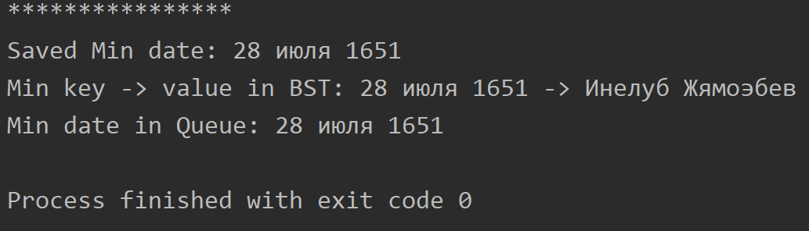

Воронов Вадим ИБ-119
# Лабораторная работа 5.
## Преобразование дерева бинарного поиска в двоичную очередь с минимальным элементом в корне.
Решение задачи достигается следующим способом:
Сначала мы "спускаемся" по двоичному дереву к минимальному элементу, ключ этого элемента добавляется в очередь. Далее, благодаря свойствам рекурсии, возвращаемся к родительскому элементу, ключ которого также добавляется в очередь; после этого алгоритм переходит к правой ветке. Таким образом элементы добавляются в очередь уже отсортированными в порядке возрастания. Минимальный элемент сразу же находится в корне очереди, можно упустить вызов метода swim(n) при insert'e в очередь.
BstToQueueClient - клиент для тестирования алгоритма. BST заполняется случайными датами и именами, сохраняя при этом минимальную дату, чтобы в будущем проверить результат. После этого ссылки на ключи(даты) копируются в очередь - convertToQueue().
### Пример вывода программы:

